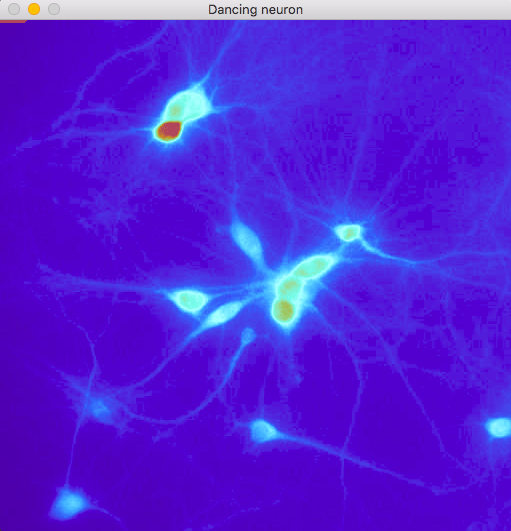

## Map sound input to calcium imaging 

Main script: `test_tap.py`
Just for fun: maps the sound input amplitude (microphone in a Mac laptop) to a video of GCaMP6s expressed in rat hippocampal primary neurons stimulated with Gabazine. Press 'q' to abort. *Requires OpenCV*. Watch a video of the script in action [here](https://vimeo.com/144476227). 

*GCaMP6 disco anyone?* 

